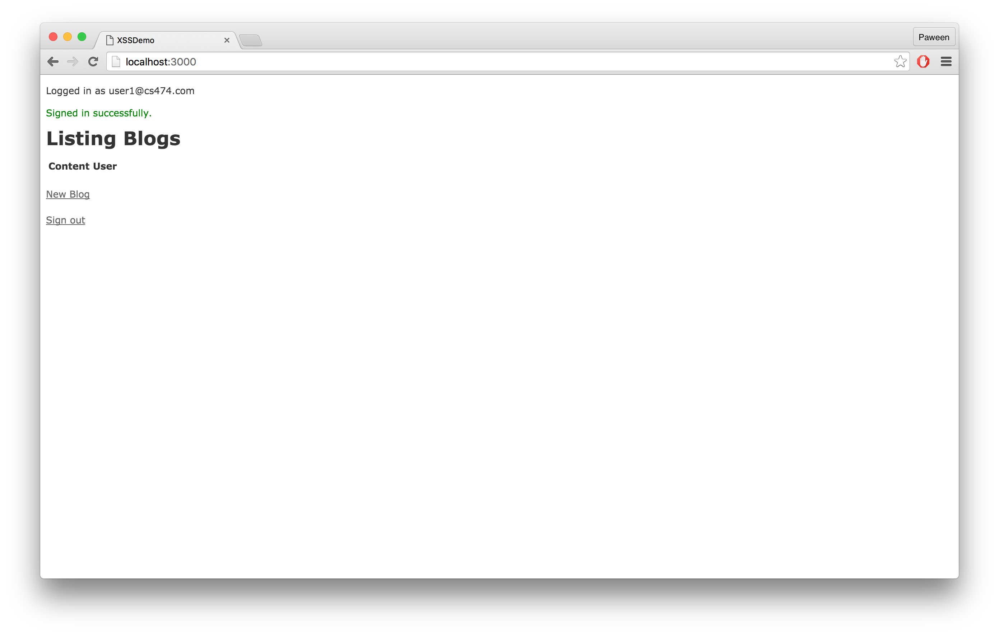
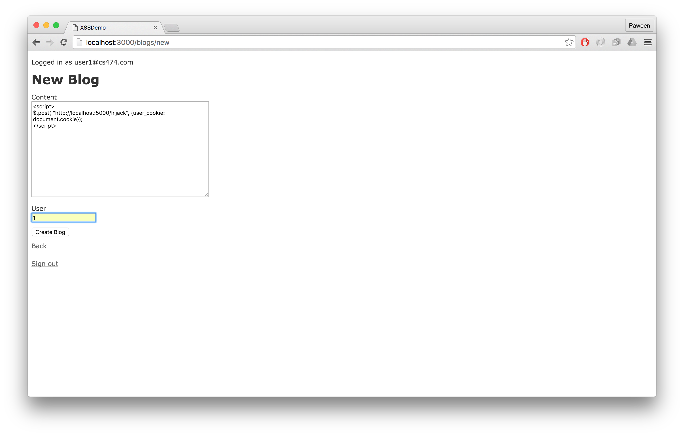
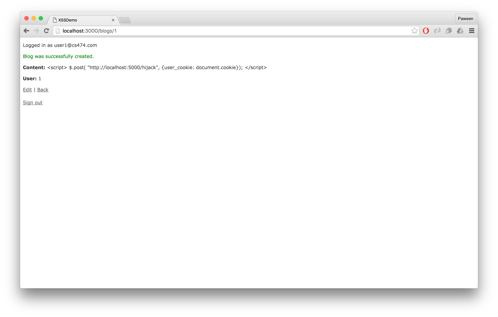
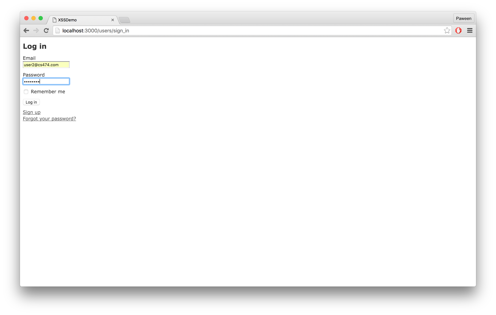
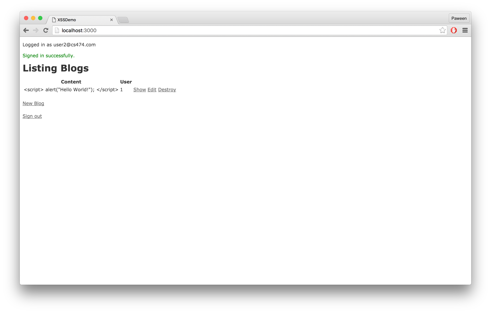
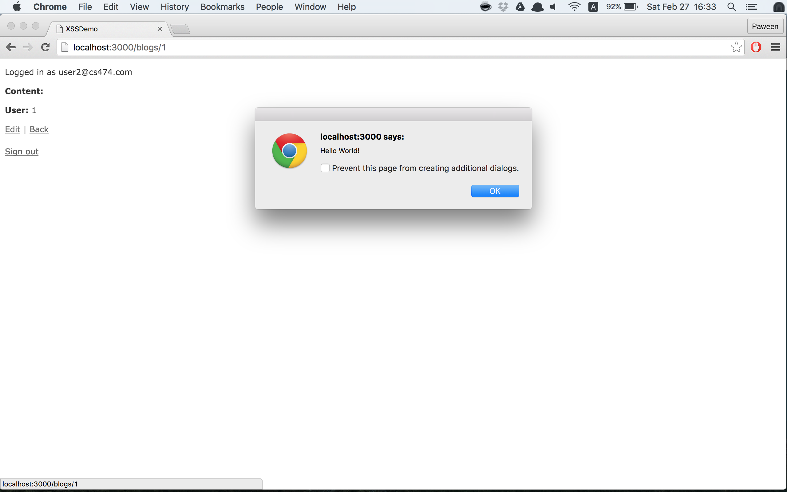
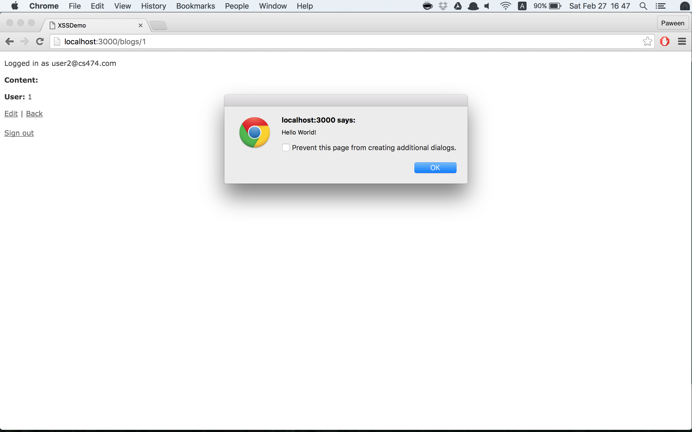
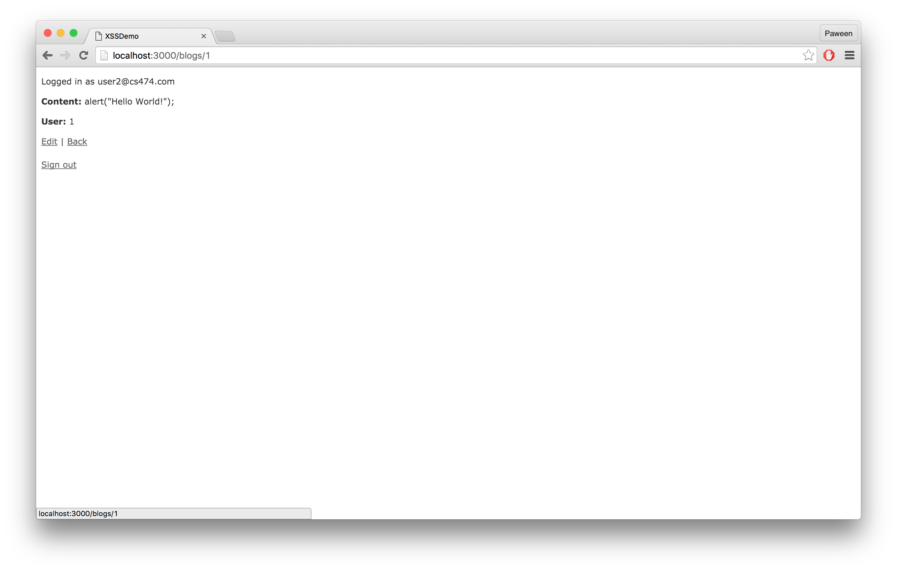

# XSS-Demo
> ICCS474 Cross-site Scripting Demo Homework

## Starting Project

```bash
$ rails new XSS-Demo --skip-spring 
$ cd XSS-Demo
```

Edit your `Gemfile` into this.

```ruby
# /Gemfile
source 'https://rubygems.org'

gem 'rails', '4.2.5'
gem 'sqlite3'
gem 'sass-rails', '~> 5.0'
gem 'uglifier', '>= 1.3.0'
gem 'coffee-rails', '~> 4.1.0'
gem 'jquery-rails'
gem 'turbolinks'
gem 'jbuilder', '~> 2.0'
gem 'sdoc', '~> 0.4.0', group: :doc
gem 'puma'
gem 'quiet_assets'
gem 'devise'

group :development, :test do
  # Call 'byebug' anywhere in the code to stop execution and get a debugger console
  gem 'byebug'
end

group :development do
  # Access an IRB console on exception pages or by using <%= console %> in views
  gem 'web-console', '~> 2.0'
  gem 'annotate'
end

```

Then run `bundle install` in the terminal.

```
$ bundle install
```

If `bundle install` can not be executed successfully, try deleting `Gemfile.lock` then run bundle install in the terminal again.

## Generating Models

### User Model

We are going to use [gem devise](https://github.com/plataformatec/devise) for authenticating the user. So first, run the following command into the terminal.

```bash
$ rails generate devise:install
```

After this, we can add `Devise` to the `User` model by run the following command.

```bash
$ rails generate devise User
```

We may want to override some views of `Devise` so let's run the following command.

```bash
$ rails generate devise:views
```

The above command will generate `Devise` views into `/app/views/devise` directory.

### Blog Model

Next, we are going to create `Blog` model that has `content:text` and `user:references` as the attributes.

```bash
$ rails generate scaffold Blog content:text user:references
```

After you generated 2 models, don't forget to run `rake db:migrate` in your terminal.

```bash
$ rake db:migrate
```

## Model Association

By using scaffold for `Blog` model, it will automatically generate association between `Blog` and `User` model like this.

```ruby
# /app/models/blog.rb

class Blog < ActiveRecord::Base
  belongs_to :user
end
```

But for the `User` model, we need to add the relationship between `User` and `Blog` model by ourselves.

```ruby
# /app/models/user.rb

class User < ActiveRecord::Base
	.
	.
	.      
  has_many :blogs
end
```


## Creating Mockup-Users

```ruby
# /db/seeds.rb

(1..3).each do |i|
  user = User.create(email: "user#{i}@cs474.com",
                      password: "12345678",
                      password_confirmation: "12345678")
  user.save!
end
```

Then run `rake db:seed` in the terminal.

```bash
$ rake db:seed
```

## User-Authentication

We want the user to be authenticated before creating the blog, so we need to add `before_action` into ApplicationController.

```ruby
# /app/controllers/application_controller.rb

class ApplicationController < ActionController::Base
	.
	.
  before_action :authenticate_user!
end
```

## Routing

```ruby
# /config/routes.rb

Rails.application.routes.draw do
  resources :blogs
  devise_for :users
  root to: 'blogs#index'
end

```

## Display user's email and sign out link

```html
<!-- /app/views/layouts/application.html.erb -->

<!DOCTYPE html>
<html>
  <head>
    <title>XSSDemo</title>
    <%= stylesheet_link_tag    'application', media: 'all', 'data-turbolinks-track' => true %>
    <%= javascript_include_tag 'application', 'data-turbolinks-track' => true %>
    <%= csrf_meta_tags %>
  </head>
  <body>

    <% if user_signed_in? %>
    <p>Logged in as
      <%= current_user.email %>
    </p>
    <% end %>

    <%= yield %>
    <br>
    <br>
    <% if user_signed_in? %>
    <%= link_to "Sign out", destroy_user_session_path, :method => :delete %>
    <% end %>
  </body>
</html>

```


## Views-Blogs

`blogs/index.html.erb`

```html
<!-- /app/views/blogs/index.html.erb -->

<p id="notice"><%= notice %></p>

<h1>Listing Blogs</h1>

<table>
  <thead>
    <tr>
      <th>Content</th>
      <th>User</th>
      <th colspan="3"></th>
    </tr>
  </thead>

  <tbody>
    <% @blogs.each do |blog| %>
      <tr>
        <td><%= blog.content %></td>
        <td><%= blog.user_id %></td>
        <td><%= link_to 'Show', blog %></td>
        <td><%= link_to 'Edit', edit_blog_path(blog) %></td>
        <td><%= link_to 'Destroy', blog, method: :delete, data: { confirm: 'Are you sure?' } %></td>
      </tr>
    <% end %>
  </tbody>
</table>

<br>

<%= link_to 'New Blog', new_blog_path %>
```

`blogs/show.html.erb`

```html
<!-- /app/views/blogs/show.html.erb -->

<p id="notice"><%= notice %></p>

<p>
  <strong>Content:</strong>
  <%= @blog.content %>
</p>

<p>
  <strong>User:</strong>
  <%= @blog.user_id %>
</p>

<%= link_to 'Edit', edit_blog_path(@blog) %> |
<%= link_to 'Back', blogs_path %>

```


## Cross-site scripting (XSS) Example

In this example, I'm going to simulate the situation where the user1 creates the content for blog and it lives inside `<script></script>` html tag. Then, we are going to let the user2 goes to view user1's blog page.

On `/app/views/blogs/show.html.erb`, we will render `@blog.content` as `HTML` instead of plain text by using `raw`, `<%== %>`, `sanitize`, and `.html_safe` to see which one is the safest function to use.

### Creating blog

* Starting the server by run `rails server` in the terminal.
* Go to [localhost:3000](http://localhost:3000)
* Log in as `user1@cs474.com`
* Password: `12345678`




* Go to [New Blog](http://localhost:3000/blogs/new) and insert the following content with user_id 1



* Click `Create Blog` button



* Then click on `Sign out` link.

### Viewing blog

* Go to [localhost:3000](http://localhost:3000)
* Log in as `user2@cs474.com`
* Password: `12345678`




#### Using `raw`

In `/app/views/blogs/show.html.erb` we will first use `raw` function to render `@blog.content`

```html
<!-- /app/views/blogs/show.html.erb -->

<p id="notice"><%= notice %></p>

<p>
  <strong>Content:</strong>
  <%= raw @blog.content %>
</p>

<p>
  <strong>User:</strong>
  <%= @blog.user_id %>
</p>

<%= link_to 'Edit', edit_blog_path(@blog) %> |
<%= link_to 'Back', blogs_path %>
```

After you have updated `/app/views/blogs/show.html.erb`, restart the server and then go to [http://localhost:3000/blogs/1](http://localhost:3000/blogs/1). You will see that the content is not being displayed anymore. Instead, the javascript that we inserted before is being executed. This is because `raw` function renders content without escaping a string. (See more on [Ruby on Rails API](http://api.rubyonrails.org/classes/ActionView/Helpers/OutputSafetyHelper.html))



#### Using `<%== %>`

Now in `/app/views/blogs/show.html.erb`, change `<%= raw @blog.content %>` into `<%= raw @blog.content %>`

```html
<!-- /app/views/blogs/show.html.erb -->

<p id="notice"><%= notice %></p>

<p>
  <strong>Content:</strong>
  <%== @blog.content %>
</p>

<p>
  <strong>User:</strong>
  <%= @blog.user_id %>
</p>

<%= link_to 'Edit', edit_blog_path(@blog) %> |
<%= link_to 'Back', blogs_path %>

```

Then restart the server and go to [http://localhost:3000/blogs/1](http://localhost:3000/blogs/1). You will see that it is the same result as we use `raw` function to render `@blog.content`.



#### Using `sanitize`

```html
<!-- /app/views/blogs/show.html.erb -->

<p id="notice"><%= notice %></p>

<p>
  <strong>Content:</strong>
  <%= sanitize @blog.content %>
</p>

<p>
  <strong>User:</strong>
  <%= @blog.user_id %>
</p>

<%= link_to 'Edit', edit_blog_path(@blog) %> |
<%= link_to 'Back', blogs_path %>

```

Restart server and go to [http://localhost:3000/blogs/1](http://localhost:3000/blogs/1). You will see that only the content inside `<script></script>` is shown. This is because `sanitize` function clean up all the `HTML` tags and `href/src` that can be exploited like `javascript`.



#### Using `.html_safe`

```html
<!-- /app/views/blogs/show.html.erb -->

<p id="notice"><%= notice %></p>

<p>
  <strong>Content:</strong>
  <%= @blog.content.html_safe %>
</p>

<p>
  <strong>User:</strong>
  <%= @blog.user_id %>
</p>

<%= link_to 'Edit', edit_blog_path(@blog) %> |
<%= link_to 'Back', blogs_path %>

```

Again, restart the server and go to [http://localhost:3000/blogs/1](http://localhost:3000/blogs/1). You will see that using `.html_safe` gives us the same result as `raw` and `<%== =`. This is because `.html_safe` marks an input string as trusted safe. Therefore, any input string that is inserted into `HTML` will not be escaping. (See more on [html_safe](http://apidock.com/rails/String/html_safe)) 


## Conclusion

In conslusion, using `sanitize` function to render html is the safest way to do so. The reason is because `sanitize` function will remove all tags and attributes of `HTML` that are unsafe. However, using `sanitize` function for sanitizing input string from the user does not guarantee that the result of rendering `HTML` will be in the right format. The output can contain unescaped characters such as `<`, `>`, or `&`.